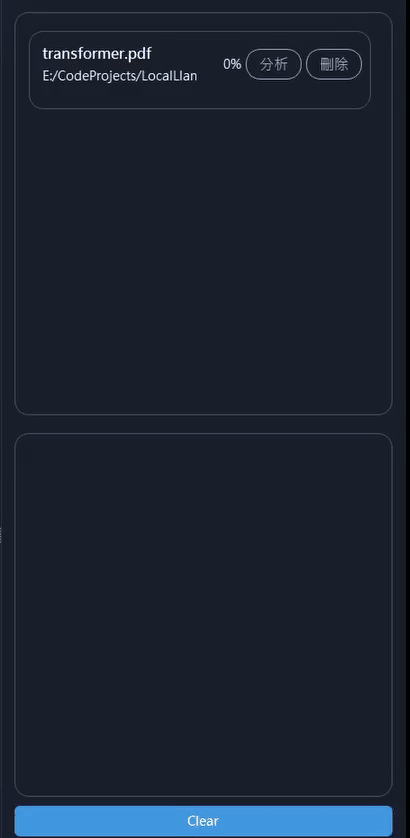
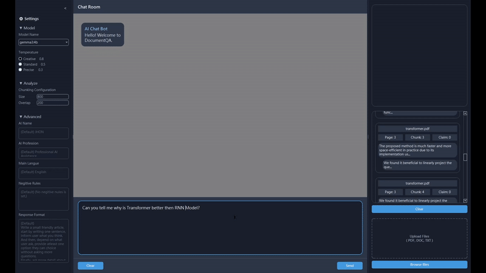
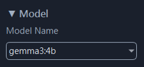
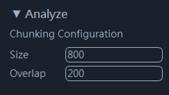
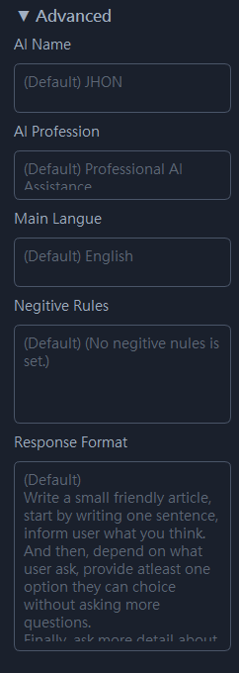

<p align="center">
  
</p>


<center>

  # DocumentQA
  Local Ollama Chat Bot with document analyze feature and a simple RAG system.
  Built with **Ollama + LangChain + FAISS + Qt5**.

</center>

---

## ▶️ Installation

**Python version**
```
Python 3.10.16
```

**Prepare Python environment**

```bash
conda env create -f requirements.yml
```

**Install Ollama and pull a model**  
For example, pulling `gemma3:4b`:
```bash
ollama pull gemma3:4b
```

---

## ▶️ Execute Application

By default, DocumentQA uses **gemma3:4b** as the core LLM model.  
If not installed, the first available model from `ollama list` will be used.

- Run with **default model**:
```bash
python run_UI.py
```

- Run with a **specific model**:
```bash
python run_UI.py -n <your_model_name>
```

- Run with **pre-built executable**
Pre-built executable is also provided in the **PreBuild** folder:
```bash
DocumentQA.exe -n <your_model_name>
```

---

## ▶️ Features

### Analyze Documents
- Each page of a document is split into smaller text sections.  
- The LLM summarizes each section and extracts **claims with supported citations**.



---

### Chat with AI
- Extracted claims are stored in the internal vector database.  
- During conversation, related claims are displayed below the AI’s response bubble.  



---

### Option Settings

- **Model Selection**  
  Change LLM during conversation, clear memory, and restart a new chat.  
  Extracted claims remain until you manually clear them.  
  

- **Chunking Parameters**  
  Adjust chunk size according to your documents.  
  Parameters apply only when starting a new analysis.  
  

- **Advanced Prompt**  
  Rewrite part of the system prompt depending on the use case.  
  Default prompt works fine for general usage.  
  

